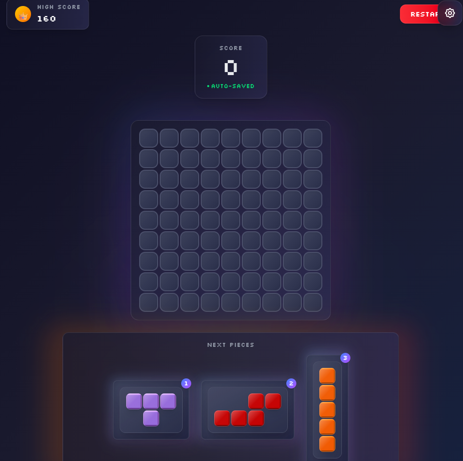

# 🎮 BLXST - Block Puzzle Game

A modern, visually stunning block puzzle game built with React, featuring smooth animations, immersive sound effects, and a beautiful dark theme. Challenge yourself with this addictive puzzle experience that combines classic block-clearing mechanics with modern UI design.

## ✨ Features

### 🎯 Core Gameplay
- **Classic Block Puzzle**: Drag and drop pieces onto a 9x9 grid
- **Line Clearing**: Clear complete rows and columns to score points
- **Combo System**: Chain multiple line clears for bonus points
- **Dynamic Difficulty**: Game gets progressively harder as your score increases
- **Smart Piece Generation**: Intelligent piece distribution system

### 🎨 Visual Design
- **Modern Dark Theme**: Beautiful gradient backgrounds with floating orbs
- **Glassmorphism Effects**: Backdrop blur and transparency throughout
- **Smooth Animations**: Fluid transitions and hover effects
- **Professional Typography**: Multiple custom fonts for enhanced readability
- **Responsive Design**: Works seamlessly on desktop and mobile devices

### 🔊 Audio Experience
- **Background Music**: Immersive Afrobeats soundtrack
- **Sound Effects**: Satisfying audio feedback for all interactions
- **Volume Controls**: Separate controls for music and sound effects
- **Mute Options**: Individual mute buttons for music and SFX

### 💾 Persistence & Settings
- **Auto-Save**: Automatic game state persistence
- **High Score Tracking**: Personal best score tracking
- **Settings Panel**: Comprehensive audio and game settings
- **Data Management**: Clear save data option

### 🎮 User Experience
- **Drag & Drop**: Intuitive piece placement system
- **Visual Feedback**: Clear indicators for valid/invalid moves
- **Hint System**: Optional hints to help find valid moves
- **Game Over Handling**: Smooth game over experience with restart options

## 🚀 Getting Started

### Prerequisites
- Node.js (v16 or higher)
- npm or yarn package manager

### Installation

1. **Clone the repository**
   ```bash
   git clone https://github.com/yourusername/blxst.git
   cd blxst
   ```

2. **Install dependencies**
   ```bash
   npm install
   ```

3. **Start the development server**
   ```bash
   npm run dev
   ```

4. **Open your browser**
   Navigate to `http://localhost:5173` to play the game

## 🎯 How to Play

1. **Objective**: Fill complete rows or columns to clear them from the board
2. **Piece Placement**: Drag pieces from the hand onto the game board
3. **Line Clearing**: When you fill a complete row or column, it disappears
4. **Scoring**: Earn points for placing pieces and clearing lines
5. **Combos**: Clear multiple lines in succession for bonus points
6. **Game Over**: The game ends when no more pieces can be placed

### 🎮 Controls
- **Mouse**: Click and drag pieces to place them
- **Touch**: Tap and drag on mobile devices
- **Hints**: Click the "Show Hints" button for placement suggestions
- **Settings**: Access audio settings via the gear icon

## 🛠️ Technical Stack

### Frontend
- **React 18**: Modern React with hooks and functional components
- **Jotai**: State management for game state and persistence
- **Framer Motion**: Smooth animations and transitions
- **Tailwind CSS**: Utility-first CSS framework for styling

### Audio
- **Howler.js**: Audio library for background music and sound effects
- **Custom Audio Manager**: Centralized audio control system

### Build Tools
- **Vite**: Fast build tool and development server
- **ESLint**: Code linting for quality assurance

## 📁 Project Structure

```
blxst/
├── src/
│   ├── components/          # React components
│   │   ├── AudioManager.jsx     # Background music controller
│   │   ├── AudioSettings.jsx    # Audio settings panel
│   │   ├── GameBoard.jsx        # Main game board component
│   │   ├── GameOverScreen.jsx   # Game over modal
│   │   ├── Hand.jsx            # Piece hand container
│   │   ├── Piece.jsx           # Individual piece component
│   │   ├── SplashScreen.jsx    # Welcome screen
│   │   └── ...
│   ├── hooks/              # Custom React hooks
│   │   ├── useDragAndDrop.js   # Drag and drop logic
│   │   ├── useLocalStorage.js  # Local storage utilities
│   │   └── useSoundEffects.js  # Sound effects hook
│   ├── atoms/              # Jotai state atoms
│   │   └── gameAtoms.js        # Game state management
│   ├── assets/             # Static assets
│   │   ├── fonts/              # Custom fonts
│   │   ├── images/             # Block images
│   │   └── music/              # Background music
│   ├── App.jsx             # Main application component
│   ├── main.jsx            # Application entry point
│   └── index.css           # Global styles and animations
├── public/                 # Public assets
├── package.json           # Project dependencies
├── vite.config.js         # Vite configuration
└── tailwind.config.js     # Tailwind CSS configuration
```

## 🎨 Customization

### Adding New Pieces
1. Define piece shapes in `src/atoms/gameAtoms.js`
2. Add to the `PIECES` array with shape matrix and weight
3. Pieces automatically get random colors

### Modifying Visuals
- **Colors**: Update gradients and colors in Tailwind classes
- **Animations**: Modify CSS animations in `src/index.css`
- **Fonts**: Add new fonts in `src/assets/fonts/`

### Audio Customization
- **Background Music**: Replace files in `src/assets/music/`
- **Sound Effects**: Modify sound generation in `src/hooks/useSoundEffects.js`

## 🏆 Scoring System

- **Block Placement**: 1 point per block placed
- **Line Clearing**: 
  - 1 line: 10 points
  - 2 lines: 25 points
  - 3+ lines: 50 points
- **Combo Multiplier**: Each consecutive line clear increases multiplier
- **Difficulty Scaling**: Higher scores generate more complex pieces

## 🎵 Audio Credits

- **Background Music**: "018 CULTUR FM (2024 Live Afrobeats Mix by MS DSF)"
- **Sound Effects**: Procedurally generated using Web Audio API

## 🤝 Contributing

1. Fork the repository
2. Create a feature branch (`git checkout -b feature/amazing-feature`)
3. Commit your changes (`git commit -m 'Add amazing feature'`)
4. Push to the branch (`git push origin feature/amazing-feature`)
5. Open a Pull Request

## 📜 License

This project is licensed under the MIT License - see the [LICENSE](LICENSE) file for details.

## 🙏 Acknowledgments

- Inspired by classic block puzzle games
- Built with modern web technologies
- Special thanks to the React and Vite communities

## 📱 Browser Support

- Chrome/Chromium (recommended)
- Firefox
- Safari
- Edge

## 🐛 Known Issues

- Audio may require user interaction on some browsers
- Performance may vary on older devices
- Some mobile browsers may have touch sensitivity differences

## 🔮 Roadmap

- [ ] Multiplayer mode
- [ ] Additional game modes
- [ ] Achievement system
- [ ] Leaderboards
- [ ] Theme customization
- [ ] Power-ups and special pieces

---

**Enjoy playing BLXST! 🎮✨**

For questions or support, please open an issue on GitHub.
